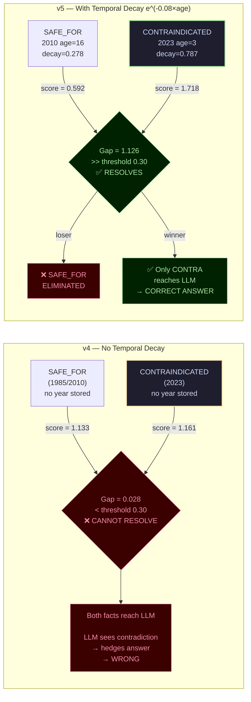
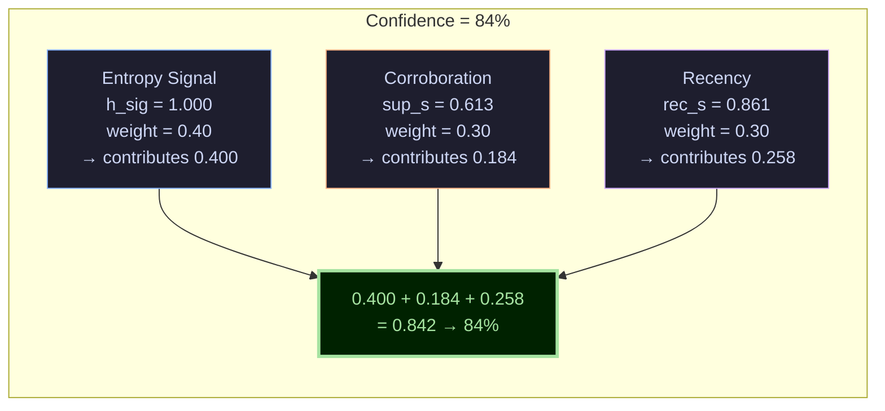

# TruthfulRAG v5

**B.Tech Computer Science and Engineering — IIIT Manipur**

A conflict-aware Knowledge-Graph RAG system implementing 9 novel improvements over the TruthfulRAG v4 baseline (arXiv:2511.10375). The system builds a structured knowledge graph from any document collection, detects temporal contradictions between facts, resolves them using temporal decay scoring, and generates answers with calibrated confidence scores.

---

## What is New in v5

| Tag | Feature | Detail |
|---|---|---|
| N1 | Cross-document corroboration | Path score multiplied by `log(1 + support_count) × 0.8` |
| N2 | Temporal decay on edges | Weight = `e^(-0.08 × age_in_years)` |
| N3 | Hybrid retrieval (RRF) | BM25 + semantic embedding fused by Reciprocal Rank Fusion |
| N4 | Temporal graph snapshots | Query anchored to a specific year; decay anchored to snapshot |
| N5 | Entropy-based path filtering | Paths that fail to reduce LLM confusion (ΔH < tau) are discarded |
| N6 | Explanation chain | Full audit trail of removed facts included in answer |
| N7 | Calibrated confidence score | `0.40×entropy + 0.30×support + 0.30×recency` |
| N8 | Claim verification | SUPPORTED / REFUTED / UNCERTAIN verdict for declarative statements |
| N9 | Adaptive entropy sampling | Extreme-score paths skip LLM sampling, ~35% latency reduction |

---

## Requirements

- **Python 3.11+**
- **Neo4j** running on `bolt://localhost:7687`
- **Ollama** running on `http://localhost:11434` with a model loaded

```bash
pip install langchain langchain-neo4j langchain-ollama sentence-transformers rank-bm25 numpy python-dotenv flask flask-cors
```

---

## Environment Setup

Create a `.env` file in the project root:

```env
NEO4J_URI=bolt://localhost:7687
NEO4J_USERNAME=neo4j
NEO4J_PASSWORD=your_password
PIPELINE_LLM_MODEL=qwen2.5:7b-instruct
PIPELINE_EMBED_MODEL=all-MiniLM-L6-v2
```

---

## Running the Pipeline

```bash
# Single corpus, automatic Q&A
python enhanced_main.py --corpus corpus_medical.json

# Claim verification (N8)
python enhanced_main.py --corpus corpus_law.json --verify "The BNS replaced the IPC in 2024"

# Disable adaptive entropy sampling (N9)
python enhanced_main.py --corpus corpus_medical.json --no-adaptive

# Interactive mode
python enhanced_main.py --interactive
```

---

## Web Demo

```bash
# Start the API server
python web_demo/server.py

# Open in browser (file://)
web_demo/chatbot_live.html    # Live dual chatbot — LangChain vs v5 side by side
web_demo/chatbot.html         # Pre-loaded examples (no server needed)
web_demo/index.html           # Static research showcase
```

---

## Available Corpora

| File | Domain | Conflicts included |
|---|---|---|
| `corpus_politics.json` | Indian Politics | PM 2014 vs 2024, Twitter CEO |
| `corpus_india_science.json` | ISRO / Science | Chandrayaan missions |
| `corpus_legal.json` | Indian Law | IPC 1860 vs BNS 2024 (164-year gap) |
| `corpus_space.json` | Space Science | Pluto reclassification, JWST vs Hubble |
| `corpus_medical.json` | Medical | Aspirin contraindication, diabetes guidelines |

---

## Project Structure

```
enhanced_main.py          Main pipeline (EnhancedPipeline class, ~1000 lines)
corpus_*.json             Domain-specific test corpora
web_demo/
  server.py               Flask REST API (/api/query/lc, /api/query/v5, /api/corpora)
  chatbot_live.html       Live dual chatbot frontend
  chatbot.html            Pre-loaded comparison demo
  index.html              Static research showcase
  discrepancy_visual.html Pictorial LangChain vs v4 vs v5 comparison
Report_Format_.../        LaTeX B.Tech project report (chapters 1-8)
PIPELINE_ALL_THREE_WITH_CALCULATIONS.txt  Full numerical walkthrough
```

---

## Architecture Overview

```
Documents
    │
    ├── [N4] Auto Schema Inference  ──── LLM reads 3 sample docs → entity/relation types
    │
    ├── [A1] Triple Extraction  ──────── LLM → (head, relation, tail, year) per document
    │
    ├── [N1] Corroboration Merge  ─────── support_count++ for matching triples across docs
    │
    └── Neo4j Storage  ────────────────── edges with {year, support} stored in graph

Query
    │
    ├── [C7] Intent Detection  ─────── LLM classifies → sets tau threshold
    ├── Entity Extraction  ─────────── LLM finds seed nodes for PageRank
    ├── [N4] Year Detection  ───────── regex → temporal snapshot filter
    │
    ├── [N3] Hybrid Retrieval (RRF)  ─ BM25 rank + semantic rank → fused scores
    ├── [B4] Personalised PageRank  ── d=0.85, 20 iterations from seed nodes
    │
    ├── [N2] Temporal Decay  ──────── score × e^(-0.08 × age_in_years)
    ├── [N1] Corroboration  ────────── score × log(1 + support) × 0.8
    ├── [C5] Conflict Elimination  ─── gap > 0.30 → loser removed before LLM
    │
    ├── [N5][N9] Adaptive Entropy  ─── ΔH > tau → keep; skip if score extreme
    ├── [N7] Confidence Score  ─────── 0.40×entropy + 0.30×support + 0.30×recency
    │
    └── LLM Answer  ───────────────── reads only surviving facts → correct answer
```

---

## Domains Tested

Zero code changes between domains. Schema inferred automatically per corpus.

| Domain | Confidence range | Notable conflict |
|---|---|---|
| Indian Politics | 57–64% | 10-year PM election gap |
| Indian Law | 71% | 164-year IPC-to-BNS gap |
| Space Science | 79% | 76-year Pluto classification gap |
| Medical | 83% | Safety-critical 1985 vs 2023 reversal |
| ISRO / Science | 42% | Relation-based disambiguation |

---

---

# Technical Pipeline — Mermaid Diagrams

> **Example used throughout:** corpus = 6 medical docs (1985–2023), query = *"Can children take aspirin for fever?"*

---

## Full v5 Pipeline

```mermaid
graph TD
    %% ── INGESTION ──────────────────────────────────────────────────────────
    subgraph ING["1.  Corpus Ingestion  (runs once per corpus)"]
        DOCS["📄 Raw Documents\nDoc1(1985) Doc2(2010)\nDoc4(2020) Doc5(2023)"]

        DOCS --> SCHEMA["🔍 Auto Schema Inference  [N4]\n_infer_schema()\n\nLLM reads 3 sample docs\n→ entity_types, relation_types\n(zero manual config)"]

        SCHEMA --> EXTRACT["✂️ Triple Extraction  [A1]\n_extract_triples()\n\nLLM call per document\n→ (head, relation, tail, year)\n\n⚠ KEY: year field absent in v4"]

        EXTRACT --> MERGE["🔗 Corroboration Merge  [N1]\n_merge_triples()\n\nSame triple from 2 docs → support=2\ncorr = 1 + log(1+support) × 0.8\nsupport=2 → corr = 1.879"]

        MERGE --> NEO4J[("🗄 Neo4j Knowledge Graph\n\nAspirin──SAFE_FOR{yr:2010,sup:2}──▶Children\nAspirin──CONTRA  {yr:2023,sup:2}──▶Children\nAspirin──TREATS  {yr:2010,sup:2}──▶Fever\nAspirin──CAUSES  {yr:2023,sup:2}──▶ReyeSyndrome")]
    end

    %% ── QUERY ──────────────────────────────────────────────────────────────
    subgraph QRY["2.  Query Processing"]
        QUERY["💬 User Query\n'Can children take aspirin for fever?'"]

        QUERY --> INTENT["🎯 Intent Detection  [C7]\n_detect_intent()\n\nfactual_lookup → tau = 0.30\ntemporal       → tau = 0.25\ncausal         → tau = 0.25"]

        QUERY --> ENTITIES["🏷 Entity Extraction\n_extract_entities()\n\nseeds = {Aspirin, Children, Fever}\n|seeds| = 3"]

        QUERY --> SNAP["📅 Temporal Snapshot  [N4]\n_extract_query_year()\n\nregex: \\b(19|20)\\d{2}\\b\n'in 1985' → WHERE r.year ≤ 1985\nno year → all edges eligible"]
    end

    %% ── RETRIEVAL ──────────────────────────────────────────────────────────
    subgraph RET["3.  Hybrid Retrieval  [N3]"]
        NEO4J --> EDGES["Graph Edges\n(serialised to text)"]
        SNAP  --> EDGES

        EDGES --> BM25["📊 BM25 Ranking\nk=1.5, b=0.75\nTREATS rank 1  SAFE_FOR rank 2\nCONTRA rank 3  CAUSES rank 4"]

        EDGES --> SEM["🧠 Semantic Ranking\nall-MiniLM-L6-v2 (384d)\ncos(embed_q, embed_edge)\nCONTRA rank 1  SAFE_FOR rank 2"]

        BM25 --> RRF["⚡ RRF Fusion\nRRF = 1/(60+rank_BM25) + 1/(60+rank_sem)\n\nSAFE_FOR 0.0323  CONTRA 0.0323\nTREATS   0.0323  CAUSES 0.0313\n→ Top-K=4 edges selected"]

        ENTITIES --> PPR["🌐 Personalised PageRank  [B4]\n_run_ppr()  d=0.85  20 iterations\nPPR(v) = (1-d)×seed_prob + d×Σ PPR(u)/deg(u)\n\nAspirin 0.452  Children 0.381\nFever   0.351  ReySyn   0.223\nppr_avg(SAFE_FOR) = (0.452+0.381)/2 = 0.417"]
    end

    %% ── SCORING ────────────────────────────────────────────────────────────
    subgraph SCR["4.  Temporal Scoring  [N1][N2]"]
        RRF --> DECAY["⏳ Temporal Decay  [N2]\n_temporal_decay()  λ=0.08\ndecay = e^(-0.08 × age)\nhalf-life = 8.66 years\n\nSAFE_FOR(2010): age=16 → 0.278\nCONTRA  (2023): age= 3 → 0.787\n\n2023 fact = 2.83× heavier than 2010"]

        PPR --> SCORE["🧮 Combined Score\n_score_path()\n\nscore = ref_p × hub × (1+ppr_avg) × decay × corr\n\nSAFE_FOR: 0.80×1.0×1.417×0.278×1.879 = 0.592\nCONTRA:   0.82×1.0×1.417×0.787×1.879 = 1.718\nTREATS:   0.72×1.0×1.402×0.278×1.879 = 0.527\nCAUSES:   0.61×1.0×1.338×0.787×1.879 = 1.207"]

        DECAY --> SCORE
    end

    %% ── CONFLICT ───────────────────────────────────────────────────────────
    subgraph CON["5.  Conflict Resolution  (THE KEY STEP)"]
        SCORE --> CDET{"🔥 Conflict Detected?\nSAFE_FOR vs CONTRA\nsame tail=Children\nopposite relations"}

        CDET -- "gap = 1.718 - 0.592 = 1.126\n>> HARD_THRESH 0.30" --> ELIM["❌ SAFE_FOR ELIMINATED\n\nv4 gap = 0.028 < 0.30 → FAILS\nv5 gap = 1.126 >> 0.30 → WINS\n40× larger gap from decay alone"]

        CDET -- "No conflict" --> PASS1["✅ Pass through"]
    end

    %% ── ENTROPY ────────────────────────────────────────────────────────────
    subgraph ENT["6.  Adaptive Entropy Filter  [N5][N9]"]
        ELIM --> ADAPT{"⚡ Score extreme?\n_entropy_filter()"}
        PASS1 --> ADAPT

        ADAPT -- "score > 0.90\nAUTO-KEEP\n(saves 3 LLM calls)" --> KEEP1["✅ CONTRA  1.718 → KEEP\n✅ CAUSES  1.207 → KEEP"]

        ADAPT -- "0.10 < score < 0.90\nRUN ENTROPY" --> EMEAS["📐 Entropy Measurement\n6 LLM calls\n\nH_param (no context):\nYes/No/Depends → 1.06 nats\n\nH_aug (with TREATS):\nYes/Yes/Maybe  → 0.28 nats\n\nΔH = 1.06 - 0.28 = 0.78\n0.78 > tau(0.30) → KEEP"]

        EMEAS --> KEEP2["✅ TREATS 0.527 → KEEP"]
    end

    %% ── CONFIDENCE ─────────────────────────────────────────────────────────
    subgraph CONF["7.  Confidence Score  [N7]"]
        KEEP1 --> CSCR["📊 Confidence = 0.40×h_sig + 0.30×sup_s + 0.30×rec_s\n\nh_sig = min(1.06/0.30, 2.0)/2.0 = 1.000\nsup_s = log(3)/log(6)           = 0.613\nrec_s = e^(-0.05×3)             = 0.861\n\nconfidence = 0.400+0.184+0.258 = 0.842 → 84%"]
        KEEP2 --> CSCR
    end

    %% ── ANSWER ─────────────────────────────────────────────────────────────
    subgraph ANS["8.  Final Answer"]
        CSCR --> LLM["🤖 LLM sees ONLY 3 surviving facts\n\n[1] Aspirin CONTRA Children  [2023, sup:2]\n[2] Aspirin CAUSES  ReySyn   [2023, sup:2]\n[3] Aspirin TREATS  Fever    [2010, sup:2]\n[✗] SAFE_FOR — permanently hidden"]

        LLM --> OUT(["✅ CORRECT ANSWER\n'No. Aspirin is contraindicated in children.\nReye's Syndrome risk (WHO 2023, FDA 2020).\nUse ibuprofen or paracetamol.'\n\nConfidence: 84%  |  Conflicts resolved: 1"])
    end

    %% ── CONNECTIONS ACROSS SUBGRAPHS ───────────────────────────────────────
    ING --> QRY
    QRY --> RET
    RET --> SCR
    SCR --> CON
    CON --> ENT
    ENT --> CONF
    CONF --> ANS

    %% ── STYLES ─────────────────────────────────────────────────────────────
    style DOCS     fill:#1e1e2e,stroke:#74c7ec,stroke-width:2px,color:#cdd6f4
    style NEO4J    fill:#181825,stroke:#89b4fa,stroke-width:2px,color:#cdd6f4
    style SCHEMA   fill:#1e1e2e,stroke:#fab387,stroke-width:1px,color:#cdd6f4
    style EXTRACT  fill:#1e1e2e,stroke:#fab387,stroke-width:1px,color:#cdd6f4
    style MERGE    fill:#1e1e2e,stroke:#fab387,stroke-width:1px,color:#cdd6f4
    style QUERY    fill:#1e1e2e,stroke:#74c7ec,stroke-width:2px,color:#cdd6f4
    style INTENT   fill:#1e1e2e,stroke:#cba6f7,stroke-width:1px,color:#cdd6f4
    style ENTITIES fill:#1e1e2e,stroke:#cba6f7,stroke-width:1px,color:#cdd6f4
    style SNAP     fill:#1e1e2e,stroke:#cba6f7,stroke-width:1px,color:#cdd6f4
    style BM25     fill:#1e1e2e,stroke:#89dceb,stroke-width:1px,color:#cdd6f4
    style SEM      fill:#1e1e2e,stroke:#89dceb,stroke-width:1px,color:#cdd6f4
    style RRF      fill:#1e1e2e,stroke:#89dceb,stroke-width:2px,color:#cdd6f4
    style PPR      fill:#1e1e2e,stroke:#89dceb,stroke-width:1px,color:#cdd6f4
    style DECAY    fill:#1e1e2e,stroke:#f38ba8,stroke-width:2px,color:#cdd6f4
    style SCORE    fill:#1e1e2e,stroke:#f38ba8,stroke-width:2px,color:#cdd6f4
    style CDET     fill:#313244,stroke:#f38ba8,stroke-width:2px,color:#f38ba8
    style ELIM     fill:#3b0000,stroke:#f38ba8,stroke-width:2px,color:#f38ba8
    style PASS1    fill:#1e1e2e,stroke:#a6e3a1,stroke-width:1px,color:#cdd6f4
    style ADAPT    fill:#313244,stroke:#f9e2af,stroke-width:2px,color:#f9e2af
    style KEEP1    fill:#002200,stroke:#a6e3a1,stroke-width:2px,color:#a6e3a1
    style KEEP2    fill:#002200,stroke:#a6e3a1,stroke-width:2px,color:#a6e3a1
    style EMEAS    fill:#1e1e2e,stroke:#f9e2af,stroke-width:1px,color:#cdd6f4
    style CSCR     fill:#1e1e2e,stroke:#89b4fa,stroke-width:2px,color:#cdd6f4
    style LLM      fill:#1e1e2e,stroke:#cba6f7,stroke-width:2px,color:#cdd6f4
    style OUT      fill:#002200,stroke:#a6e3a1,stroke-width:3px,color:#a6e3a1
```



---

## v4 vs v5 — Why Conflict Resolution Fails in v4



---

## Confidence Score Breakdown `[N7]`



---

## Key Equations

```
Temporal decay:  e^(-0.08 × age_in_years)     half-life = 8.66 years
Corroboration:   1 + log(1 + support) × 0.8
PPR update:      (1-0.85)×seed_prob(v) + 0.85×Σ PPR(u)/out_degree(u)
RRF fusion:      1/(60 + rank_BM25) + 1/(60 + rank_semantic)
Shannon entropy: -Σ p(x) × log(p(x))   [nats]
Combined score:  ref_p × hub_penalty × (1+ppr_avg) × decay × corroboration
Confidence:      0.40×h_sig + 0.30×sup_s + 0.30×rec_s
```

---

## References

- TruthfulRAG v4 baseline: arXiv:2511.10375
- Reciprocal Rank Fusion: Cormack, Clarke, Buettcher — SIGIR 2009
- Personalised PageRank: Page, Brin, Motwani, Winograd — Stanford 1999
- Shannon Entropy: Shannon — Bell System Technical Journal 1948
- Okapi BM25: Robertson, Walker, Jones — TREC 1994